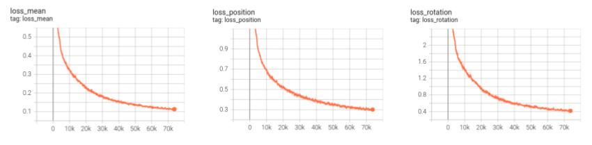

# Regression of Relative Pose

**Relative Work**:
* image matches (deep flow) to relative pose. separate the task into two tasks.
  * how to train the match, aiming at better relative pose.
  * how to use lines, plane information.
* pose net, pose from model.
  * not a general task.

**Make relative pose regression**:
* camera intrinsics problem
  * how to add intrinsics to the problem? add the intrinscs as input to the model.
* regression of fundamental matrix:
  * to essential matrix to pose : has 4 candidates, cannot know the best on without feature match.
  * how to make the model tell the best pose out of the 4 candidates?


## prepare data

prepare data with
```
python relative_pose/dataset.py /mnt/gz01/experiment/liuye/relative_pose
```


## train

```
python relative_pose/train.py \
--images_folder=/mnt/gz01/experiment/liuye/relative_pose \
--pair_pickle=/mnt/gz01/experiment/liuye/relative_pose/all_data_pairs.pickle \
--restore_ckpt=/RelativePoseNet/checkpoints/xxx_raft.pth
```

```
tensorboard --logdir=runs
```

## experiment

Parameter Count: 1624711. Train with 34127 pairs.




## reconstruction test

```
python reconstruction_test.py \
/mnt/gz01/experiment/liuye/relative_pose/20220726T162250+0800_xvnxa_xvnxa001_gzns_2jmw2/colmap/images/camera_front \
/RelativePoseNet/checkpoints/100000_raft.pth
```
